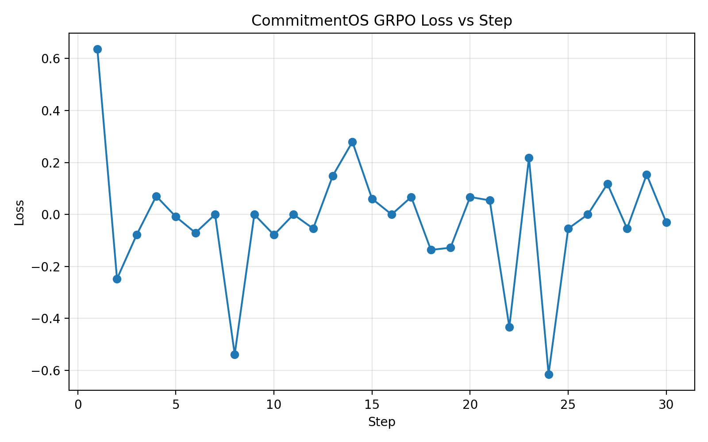
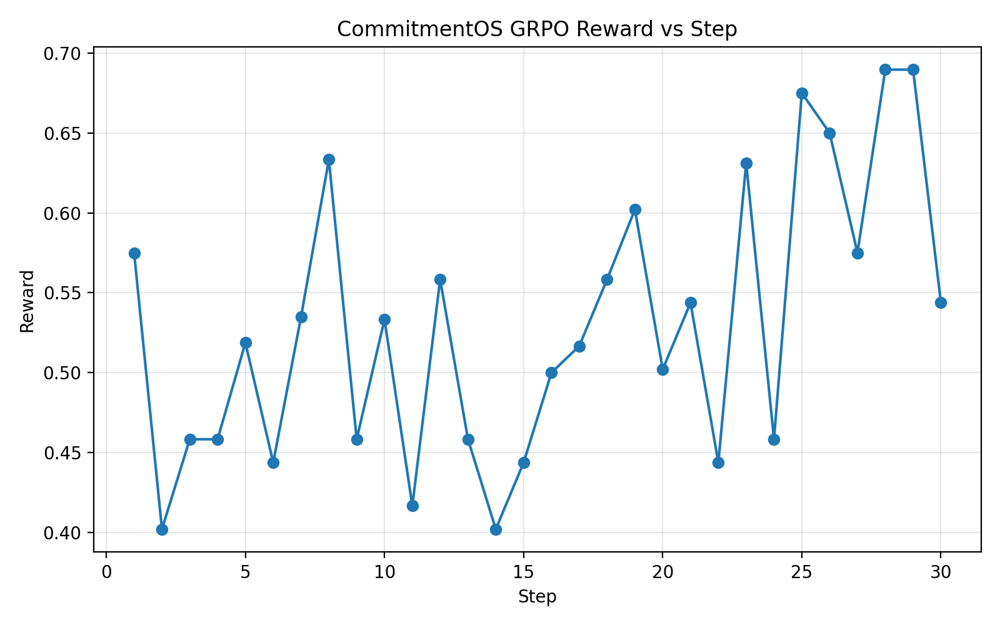
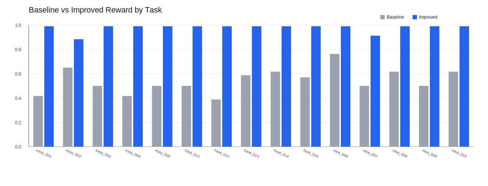
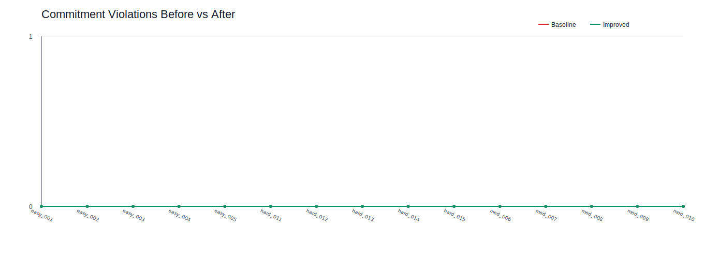

# CommitmentOS: Training Temporal Commitment Coherence in LLMs

> *The first RL environment that trains LLMs to keep their promises.*

**Innovation claim**: The first RL environment for training temporal commitment coherence — where the agent's own prior decisions create binding future constraints, tracked and penalised across multi-turn episodes.

**Theme**: Primary 3.2 (Personal Tasks) + Secondary Theme 2 (Long-Horizon Planning)

## Links
- **Blog / Writeup**: [Jayant2304/Commitment-os (model card)](https://huggingface.co/Jayant2304/Commitment-os)
- **GitHub:** [Jayant2304/commitment_os](https://github.com/Jayant2304/commitment_os)
- **Hugging Face Space** (live API + Space README): [Jayant2304/commitment-os](https://huggingface.co/spaces/Jayant2304/commitment-os)
- **Pitch (additional materials):** the Hugging Face Space card and Space README are the short judge-facing narrative (problem → environment → reward → verification). If the hackathon form asks for a separate link, add a public under-2-minute video or slide deck URL there.
- **Colab — GRPO training:** [CommitmentOS_Training.ipynb](https://colab.research.google.com/github/Jayant2304/commitment_os/blob/main/training/CommitmentOS_Training.ipynb)
- **Colab — LLM checkpoint eval** (base vs LoRA): [CommitmentOS_Checkpoint_Eval_Colab.ipynb](https://colab.research.google.com/github/Jayant2304/commitment_os/blob/main/evaluation/CommitmentOS_Checkpoint_Eval_Colab.ipynb)
- **Deterministic eval artifacts:** [artifacts/evals/README.md](artifacts/evals/README.md)
- **LLM eval artifact layout:** [artifacts/evals_llm/README.md](artifacts/evals_llm/README.md)
- **Pretrained bundle (Drive):** [commitment_os_bundle](https://drive.google.com/drive/folders/1yexZBSqyH7gWlTzYN5DlX3tXfPMmeVAK?usp=sharing)

## Judge quick verify (≈3 minutes)

1. **Live API:** open the Hugging Face Space and run the curl examples on the card (`/health`, `POST /reset?task_id=easy_001`, `POST /step`, `GET /state`).
2. **Training curves in git:** `artifacts/loss_curve.png`, `artifacts/reward_curve.png`, plus `artifacts/training_metrics.json` / `training_summary.csv` (same run as the Colab training notebook).
3. **Deterministic benchmark:** `artifacts/evals/README.md` and `artifacts/evals/summary.json` (fixed 15-task scripted rollouts).
4. **True LLM checkpoint eval:** Colab in **Links**; protocol + traces in the Drive bundle under `artifacts/evals_llm/`; layout in `artifacts/evals_llm/README.md`.
5. **MCP:** `POST /mcp` with JSON-RPC `tools/list` advertises `cos_episode_reset`, `cos_environment_step`, and `cos_session_snapshot` (names avoid reserved MCP/OpenEnv collisions with `reset` / `step` / `state`). HTTP control endpoints remain `POST /reset`, `POST /step`, and `GET /state`.

---

## Architecture

```
┌──────────────── Client ────────────────┐     ┌────────────── CommitmentOS Server ──────────────┐
│                                        │     │                                                 │
│  inference.py ──HTTP──▶ POST /reset    │────▶│  FastAPI App                                    │
│  (LLM agent)    HTTP──▶ POST /step     │     │    │                                            │
│                  HTTP──▶ GET  /state    │     │    ▼                                            │
│                                        │     │  CommitmentEnvironment                          │
│  train_grpo.py                         │     │    ├── WorldState (calendar, contacts,           │
│  (GRPO+TRL)                            │     │    │   restaurants, inbox)                       │
│                                        │     │    ├── CommitmentLedger (tracks promises)        │
│                                        │     │    └── Grader (5-component reward)               │
└────────────────────────────────────────┘     └─────────────────────────────────────────────────┘
```

## Why CommitmentOS is Novel

Existing constraint-satisfaction environments (GAP, LGC-MARL, NeMo Gym, PEARL) compute dependency graphs **upfront**. CommitmentOS is fundamentally different:

- **Constraints emerge from the agent's own decisions** as the episode unfolds
- A meeting scheduled in turn 2 becomes a **binding constraint** in turn 7
- Breaking it without communication is a **tracked, penalised violation**
- The commitment ledger persists across the full episode — the agent must remember what it promised

This is **temporal commitment coherence** — a capability no existing RL environment trains.

---

## Quick Start

### Local Development

```bash
cd commitment_os

# Create virtual environment
python3 -m venv .venv && source .venv/bin/activate
pip install -r requirements.txt

# Optional: editable install + LLM checkpoint eval deps (torch, transformers, peft, …)
# pip install -e ".[llm-eval]"
# pip install -e ".[dev,inference]"

# Start server
uvicorn server.app:app --host 0.0.0.0 --port 7860 --reload

# Run tests
pip install pytest httpx
pytest tests/ -v
```

### Docker

```bash
docker build -t commitment-os .
docker run -p 7860:7860 commitment-os
```

### Hugging Face Space (sync from this repo)

Hugging Face **rejects `git push` that include certain binaries** (for example `artifacts/*.png`), while GitHub keeps those PNGs. Use the same workflow as before: **clone the Space repo, `rsync` the project without `*.png`, copy `HF_README.md` → `README.md` for the Space card, commit, push** — scripted as:

```bash
cd commitment_os
export HF_TOKEN=…   # HF token with write access to the Space
./scripts/sync_hf_space.sh "Optional commit message"
```

Override clone directory with `HF_SYNC_CLONE_DIR` if needed. Code changes still land on GitHub via normal `git push origin`; run this script when you want the Space to catch up.

### API Usage

```bash
# Reset to a scenario
curl -X POST "http://localhost:7860/reset?task_id=easy_001"

# Make a tool call (multi-turn — one per step)
curl -X POST "http://localhost:7860/step" \
  -H "Content-Type: application/json" \
  -d '{"action": {"action_type": "view_calendar", "date": "2026-04-25"}}'

# Get state
curl "http://localhost:7860/state"

# List all scenarios
curl "http://localhost:7860/tasks"
```

---

## Reward Function (5 Components)

| Component | Weight | How it's Measured |
|-----------|--------|-------------------|
| **Constraint Satisfaction** | 35% | Binary per-constraint checks |
| **Conflict Resolution** | 20% | Final calendar free of overlapping events |
| **Commitment Coherence** | 20% | `(total - silent_violations) / total` from ledger |
| **Communication Quality** | 15% | Keyword matching on sent emails |
| **Step Efficiency** | 10% | `max(0, 1 - (steps - optimal) × 0.1)` |

**Example** (easy_001 — perfect run):
```
constraints: 3/3 met         → 0.35 × 1.0 = 0.350
conflicts:   0 overlaps      → 0.20 × 1.0 = 0.200
commitments: 1 honored       → 0.20 × 1.0 = 0.200
emails:      Team notified   → 0.15 × 1.0 = 0.150
efficiency:  3 steps (opt 3) → 0.10 × 1.0 = 0.100
─────────────────────────────────────────────
total = 0.99 (clamped to [0.01, 0.99])
```

---

## 15 Scenarios

### Easy (2-4 steps)
| ID | Description |
|----|-------------|
| easy_001 | Double-booked meetings — reschedule by priority |
| easy_002 | Book dinner with cuisine/price/distance constraints |
| easy_003 | Check availability and propose meeting slots |
| easy_004 | Cancel conflicting work meeting for personal appointment |
| easy_005 | Triage inbox by urgency priority |

### Medium (5-8 steps)
| ID | Description |
|----|-------------|
| med_006 | Cascading reschedule chain (A→B→C dependency) |
| med_007 | Team dinner with 3 dietary + distance + budget constraints |
| med_008 | Boss's urgent request during client call (commitment conflict) |
| med_009 | Disambiguate vague "push our thing" across 3 recurring meetings |
| med_010 | Client visit: conference room + lunch + itinerary |

### Hard (8-15 steps)
| ID | Description |
|----|-------------|
| hard_011 | VP investor dinner: cascade, restaurant, multi-party notification |
| hard_012 | Triple conference room conflict with diplomatic resolution |
| hard_013 | Triple crisis: cancelled flight + moved board prep + lost reservation |
| hard_014 | Information asymmetry — schedule without revealing confidential reasons |
| hard_015 | **SRE Crisis** — production incident interrupts day of commitments |

---

## Training

### GRPO + TRL + LoRA

`training/train_grpo.py` imports the in-repo environment; install **`openenv-core`** (not the unrelated `openenv` PyPI name).

```bash
pip install "openenv-core>=0.2.0" trl transformers peft datasets torch accelerate pydantic

python training/train_grpo.py \
  --model Qwen/Qwen2.5-1.5B-Instruct \
  --epochs 2 \
  --lr 5e-6 \
  --batch_size 1 \
  --group_size 2 \
  --lora_rank 16 \
  --lora_alpha 32 \
  --output_dir ./training_output
```

On a larger GPU you can raise `--batch_size` / `--group_size` (defaults in code are higher). Use `--push_to_hub` and `HF_TOKEN` to upload the adapter.

**What improves with training:**
- Constraint satisfaction score ↑
- Commitment violation rate ↓
- Steps per episode ↓
- Communication quality ↑

### Real Training Run (Colab)

The following metrics are from an actual GRPO run on `Qwen/Qwen2.5-1.5B-Instruct`:

- Runtime: **507.6 seconds** (~8.46 min)
- Steps: **30**
- Epochs: **2**
- Final train loss: **-0.02182**
- Reward range during training: **0.4021 -> 0.6896**
- Final reward: **0.5437**

Numeric training logs committed under `artifacts/`:

- `artifacts/training_metrics.json` — per-step loss, reward, etc.
- `artifacts/training_summary.csv` — tabular summary
- `artifacts/loss_curve.png` and `artifacts/reward_curve.png` — plots exported from the same logged run (regenerate from [CommitmentOS_Training.ipynb](https://colab.research.google.com/github/Jayant2304/commitment_os/blob/main/training/CommitmentOS_Training.ipynb) or plot `training_metrics.json` locally)



*Training loss — GRPO on `Qwen/Qwen2.5-1.5B-Instruct` (Colab run, metrics in `training_metrics.json`).*



*Mean episode reward during the same run (peaks ~0.69).*

The logged run shows non-trivial reward movement and confirms the training loop runs end-to-end against the environment (not a static dataset baseline).

---

## Improvement Evidence (Judge-Facing)

To make improvements verifiable in under 3 minutes, this repo now includes:
- a deterministic scripted-policy sanity benchmark, and
- a true pre-RL vs post-RL checkpoint evaluation pipeline.

### A) Deterministic Scripted-Policy Benchmark

This benchmark compares **fixed scripted rollouts** (baseline vs improved-style policies), **not** two different neural checkpoints. Use **section B** for real base-model vs LoRA comparisons.

- Task set: fixed `easy_001` ... `hard_015` (15 tasks)
- Seed: `42`
- Max steps: `12`
- Decode config (matched across both runs): `temperature=0.0`, `top_p=1.0`, `max_new_tokens=256`
- Action parsing: strict `CommitmentAction` schema
- Protocol file: `artifacts/evals/eval_protocol.json`

### Scripted Benchmark Deltas

From `artifacts/evals/summary.json`:

| Metric | Baseline | Trained-style | Delta |
|-------|----------:|--------------:|------:|
| Mean reward | 0.5427 | 0.9777 | +0.4350 |
| Median reward delta | - | - | +0.4200 |
| Success rate | 0.3333 | 1.0000 | +0.6667 |
| Mean steps | 1.0000 | 3.5333 | +2.5333 |
| Mean violations | 0.0000 | 0.0000 | +0.0000 |

Per-difficulty reward deltas:

| Difficulty | Baseline mean | Trained-style mean | Delta |
|-----------|---------------:|-------------------:|------:|
| Easy | 0.4967 | 0.9687 | +0.4720 |
| Medium | 0.5992 | 0.9745 | +0.3753 |
| Hard | 0.5323 | 0.9900 | +0.4577 |

### Scripted Benchmark Artifacts

- Raw evaluations: `artifacts/evals/baseline_eval.json`, `artifacts/evals/trained_eval.json`
- Task-wise deltas: `artifacts/evals/comparison.csv`
- Hard-scenario narrative: `artifacts/evals/case_study_hard_011.md`
- Visuals:
  - 
  - 

### Reproduce Locally

```bash
cd commitment_os
python3 evaluation/evaluate_improvement.py
python3 evaluation/plot_improvement.py
```

### B) True LLM Learning Eval (Pre-RL vs Post-RL)

For actual learning proof, run the same protocol on:
- baseline model (`BASELINE_MODEL_NAME`)
- RL-trained LoRA adapter on disk (`TRAINED_MODEL_PATH`)

Both runs use identical seed, decode settings, max steps, and parser.

See `.env.example` for all variables: set **`TRAINED_MODEL_PATH`** to the directory that contains `adapter_config.json` (for example `./training_output` after `train_grpo.py`). The evaluator does not read a Hub-only model name for the adapter.

```bash
cd commitment_os
# Recommended (declared in pyproject.toml optional extra llm-eval):
pip install -e ".[llm-eval]"
# Or equivalent one-liner:
# pip install transformers peft accelerate torch sentencepiece pydantic requests

export BASELINE_MODEL_NAME=Qwen/Qwen2.5-1.5B-Instruct
export TRAINED_MODEL_PATH=/content/commitment_os/training_output
export ENV_BASE_URL=https://jayant2304-commitment-os.hf.space
# Optional if the base model is gated:
# export HF_TOKEN=...

python3 evaluation/evaluate_llm_checkpoints.py
python3 evaluation/plot_llm_checkpoints.py
```

**Published LLM eval (one Colab run, same protocol as `llm_eval_protocol.json` in the Drive bundle):** success rate **0.467 → 0.600** (threshold 0.6); mean reward **0.662 → 0.656** (flat); **hard** difficulty mean reward **0.560 → 0.612**. Full per-task traces: `artifacts/evals_llm/` inside the [Drive folder](https://drive.google.com/drive/folders/1yexZBSqyH7gWlTzYN5DlX3tXfPMmeVAK?usp=sharing).

Outputs are written to `artifacts/evals_llm/`:
- `llm_eval_protocol.json`
- `baseline_llm_eval.json`
- `trained_llm_eval.json`
- `llm_comparison.csv`
- `llm_summary.json`
- `llm_case_study_hard_015.md`
- `llm_reward_by_task.svg`
- `llm_violations_before_after.svg`

**Why those zips are not committed in git:** a single bundle (`training_output` + `artifacts/evals_llm/`) is often **on the order of ~100–400MB** (yours was about **330MB** total—totally normal). Checking that into **main branch history** still makes every `git clone` pull hundreds of MB forever and is painful to rewrite. We **gitignore** `training_output/` so day-to-day commits stay small.

**Where ~330MB *should* live (pick one):**

| Place | When to use |
|-------|----------------|
| **GitHub Releases** | Best default: attach `commitment_os_bundle.zip` to a tagged **Release** (not the git tree). Releases support large assets; clones stay small. Add the release URL in your paper, HF card, or a one-line note in this README. |
| **Google Drive** | Fine for personal backup; share a view-only link. Colab can `gdown --folder` or you download manually. Less ideal for anonymous “repro without auth” unless the link is public. |
| **Hugging Face Hub** | Put **`training_output`** (LoRA + tokenizer) in a **model repo**; keep eval JSON/SVG in a **dataset** or second repo if you want. Good for ML readers; use your new token, not chat. |
| **Git LFS** | Only if you truly want binaries tracked in git: install LFS, `git lfs track "*.safetensors"` (and patterns you need), then commit. Still increases clone size for everyone with LFS enabled. |

**Published bundle (Google Drive):** LoRA + tokenizer + LLM eval artifacts (same layout as a local run):

[commitment_os_bundle on Google Drive](https://drive.google.com/drive/folders/1yexZBSqyH7gWlTzYN5DlX3tXfPMmeVAK?usp=sharing)

Contents: `training_output/` (adapter + metrics), `artifacts/evals_llm/` (JSON, CSV, SVG, protocol). After download, point `TRAINED_MODEL_PATH` at the `training_output` folder that contains `adapter_config.json` (nested paths may differ if you unzip inside Colab).

**Option A — GitHub Release zip** (replace `RELEASE_URL`):

```bash
curl -L -o commitment_os_bundle.zip "RELEASE_URL"
unzip -q commitment_os_bundle.zip -d .
export TRAINED_MODEL_PATH="$(pwd)/training_output"
```

**Option B — Google Drive folder in Colab** (`pip install gdown` once):

```bash
gdown --folder "https://drive.google.com/drive/folders/1yexZBSqyH7gWlTzYN5DlX3tXfPMmeVAK"
# gdown creates a directory (often the folder title, e.g. commitment_os_bundle/):
export TRAINED_MODEL_PATH="$(pwd)/commitment_os_bundle/training_output"
```

If the directory name differs, set `TRAINED_MODEL_PATH` to the folder that contains `adapter_config.json`.

---

## Submission Compliance

| Requirement | Status |
|-------------|--------|
| reset() / step() / state() | ✅ |
| openenv.yaml with 15 tasks | ✅ |
| Programmatic graders, scores ∈ (0, 1) | ✅ |
| inference.py at root using openai client | ✅ |
| [START]/[STEP]/[END] log format | ✅ |
| API_BASE_URL / MODEL_NAME / HF_TOKEN from env | ✅ |
| Dockerfile builds and responds to /reset | ✅ |
| pyproject.toml with [project.scripts] | ✅ |
| uv.lock generated | ✅ |
| server/app.py main() with if __name__ | ✅ |
| `.env.example` lists inference + LLM eval variables | ✅ |
| Colab notebooks (training + checkpoint eval) + Drive bundle | ✅ |

**Docker scope:** the image installs server dependencies from `requirements.txt` and runs the FastAPI app. For `inference.py` or LLM eval inside the container, install extras manually (`openai`, `requests`, `trl`, etc.) or extend the Dockerfile.

---

## Story Hook

> "Every AI assistant today can schedule one meeting. But your real life is never one meeting. CommitmentOS trains AI to juggle the chaos — and penalises it when it breaks its own promises."

**Connection to Round 1**: In Round 1, we trained agents to diagnose production incidents. In Round 2, we asked: *what happens when that incident interrupts a day full of commitments?* CommitmentOS was born. Hard scenario `hard_015` directly reuses SRE incident data from Round 1.

---

## License

MIT
